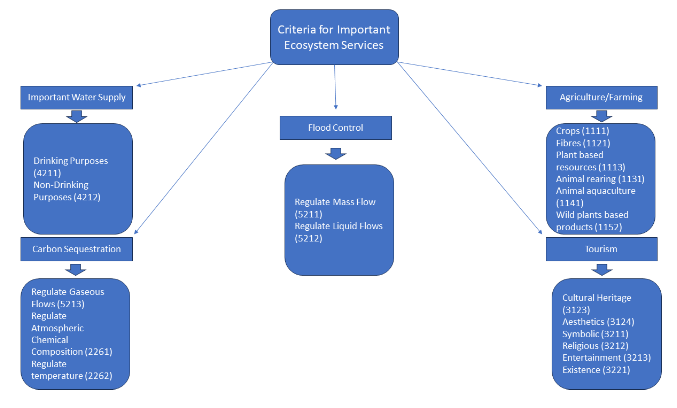

## Selecting Important Ecosystem Services

Based on the different ecosystem services (ES) mapped onto the watershed of Selangor River, a few ES that are important are highlighted and assessed based on a few criteria that is the relationship between certain ecosystem services and the flood impacts in the Selangor River Watershed. According to a study conducted by Zahidi et al (n.d), the important ecosystem services are assessed based on public surveys with regards to the social values of each ecosystem service. According to Zahidi et al (n.d), it can be deduced that the most important social values based on ecosystem services are biodiversity, tourism and health and as for the least important social values they are culture and aesthetics. In accordance with Common International Classification of Ecosystem Services (CICES) Version 5.1, the related ecosystem services are 3.1.1.1 (characteristics of living systems that promote health via active interactions ), 3.1.1.2 (characteristics of living systems that promote health via passive interactions and 4.2.1.1 (surface water for drinking).

Besides that, another important aspect of selecting important ecosystem services is  the river acting as an important water source for drinking, irrigation, as well as agricultural and industrial activities.  According to Kusin et al (2016), the Selangor River which serves as an important water resource contributes to 60% of the water consumption in Klang Valley and the demand for water is increasing with the growth of population and economy in the Klang Valley Region.

Another important ES criteria related to the Selangor River Watershed is the role of a flood regulator. The wetlands in the Kuala Selangor Nature Park, located along the river primarily slow down and regulate the floodwaters thereby lowering the potential of floods happening downstream as well as protection nearby communities (Asmawi, Abdul Aziz & Abdulaziz, 2009). The wetlands are located in swampy areas with mangrove trees where water is present near the layers of soil. Besides that, the barrages in Bestari Jaya and the dam at Kuala Kubu Baharu also help to control the flow of floods along the river (Boelee et al., 2017).

Apart from that, the watershed areas of the river are natural habitats for different species of flora and fauna. Based on literature review, the types of species typically found in the vicinity of the Kuala Selangor Nature Park include mangrove trees, fireflies, monkey species and birds (Asmawi, Abdul Aziz & Abdulaziz, 2009). All of these species interact with each other creating a dynamic and balanced ecosystem.

Agriculture and farming  is common in the surrounding area of the catchment areas of the Selangor River. The common agricultural activities are oil palm plantations and rubber estates followed by paddy fields in low lying areas (Othman et al, 2017) but other activities such as fruits and vegetables are not uncommon either. Animal and livestock farming is also present in certain areas of the catchment areas.

Another criterion of important ES in the catchment area is carbon sequestration which is defined as the removal and trapping of carbon dioxide from the atmosphere in order to maintain carbon balance. In terms of ES, carbon sequestration is regarded as a regulating service as it involves controlling the amount of carbon dioxide in the atmosphere. The carbon dioxide which is considered a greenhouse gas, will be reduced thus reducing global warming and the changes in climatic conditions. According to Hemati et al (2014), the presence of mangrove trees in Kuala Selangor Nature Park aids the removal of carbon dioxide as the carbon storage value recorded is 22.61 kg C m-2, thus proving that mangrove trees have the potential on removing and storing carbon dioxide. 
Tourism and recreation are another aspect related to the ES of the Selangor River Area. The lustre and natural beauty of the watershed areas around the Selangor River is a perfect attraction for tourists to carry out activities such as hiking, fishing, sightseeing, and watching fireflies and this will boost domestic tourism around the vicinity which will benefit the locals in many different ways. The catchment area also contains cultural element in terms of historical values and spirituality which would be attractive and pleasing to visitors.

### References

* River Habitat | NOAA Fisheries. July 10, 2023. https://www.fisheries.noaa.gov/national/habitat-conservation/river-habitat
* Faradiella Mohd Kusin, Siti Nurjaliah Muhammad, Mohd Syakirin Md Zahar & Zafira Madzin (2016) Integrated River Basin Management: incorporating the use of abandoned mining pool and implication on water quality status, Desalination and Water Treatment, DOI: 10.1080/19443994.2016.1168132
* Asmawi,M.Z., Abdul Aziz, Z.A. & Abdulaziz, H. (2009). Wetland Management of Kuala Selangor Nature Park, Malaysia., International Seminar on Wetland and Sustainability Kota Kinabalu Sabah. http://irep.iium.edu.my/3336/1/wetland_zainora_120609.pdf 
* Hemati, Z., Hossain, M., Emenike, C.U. & Zakaria, R.M. (2014). Rate of Carbon Storage in Soil of Natural and Degraded Mangrove Forest in Peninsula Malaysia. Clean Soil Air Water, https://doi.org/10.1016/j.seares.2021.102113
* Othman, F., Chowdhury, M.S.U, Wan Jaafar, W.Z., Faresh, E.M.M. & Shirazi, S.M (2017). Assessing the Risks and Sources of Heavy Metals in a Tropical River Basin: A Case Study of the Selangor River, Malaysia. Polish Journal of Environmental Studies, DOI: 10.15244/pjoes/76309
* Boelee, L., Bahrom, R., Amer, H., Sondor, N.Z., Brown, E., Ahmad, F. & Wilson, G (2017). Operational decision support system for sustainable water resource management for Sungai Selangor. E-proceedings of the 37th IAHR World Congress. https://eprints.hrwallingford.com/1211/1/HRPP752.pdf
* Radin Mohamed, R.M.S., Adnan, M.N., Mohamed, M.A. & Mohd Kassim, A.H. (2016). Conventional Water Filter (Sand and Gravel) for Ablution Water Treatment, Reuse Potential and Its Water Savings. Journal of Sustainable Development, Canadian Center of Science and Education.                                           https://doi.org/10.5539/jsd.v9n1p35