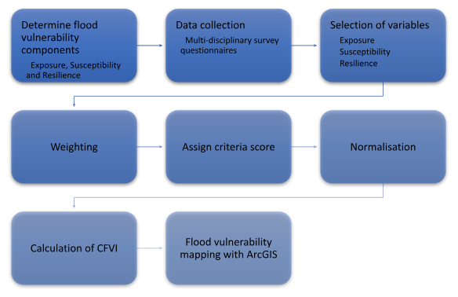

## Vulnérabilité

La cartographie de la vulnérabilité est effectuée en développant d'abord l'indice de vulnérabilité aux inondations (FVI). Dans cette recherche, l'indice composite a été choisi comme la méthode indicatrice appropriée pour accomplir cette tâche. Selon les recherches menées par Jha et Gundimeda (2019), la méthode de l'indice composite peut mieux représenter le niveau de vulnérabilité d'une zone. De plus, elle aide également à simplifier des données techniques complexes pour en faciliter l'interprétation.

Organigramme méthodologique pour le développement de l'indice composite de vulnérabilité aux inondations (CFVI)

